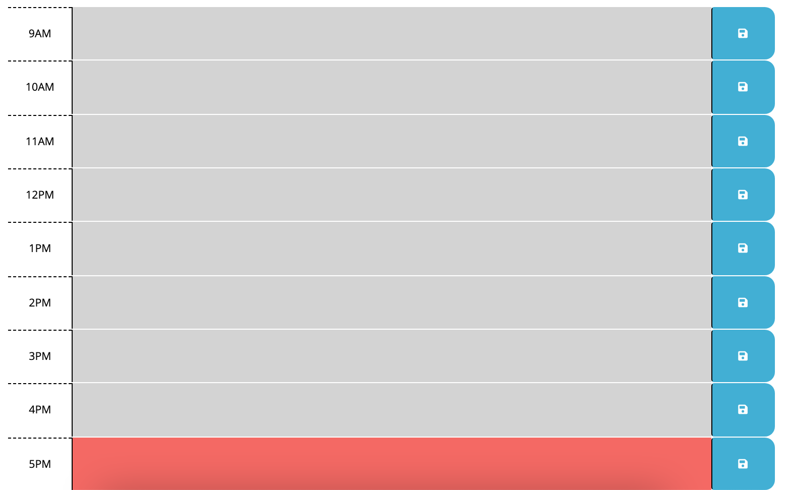
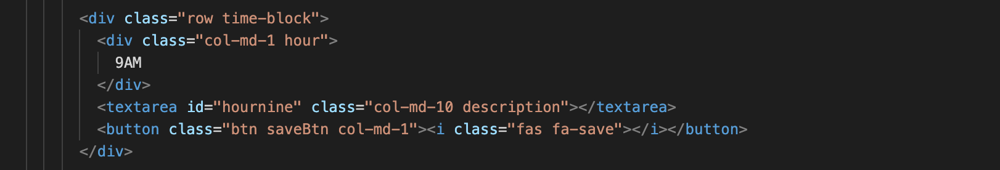
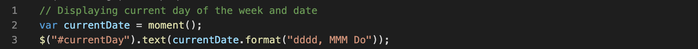
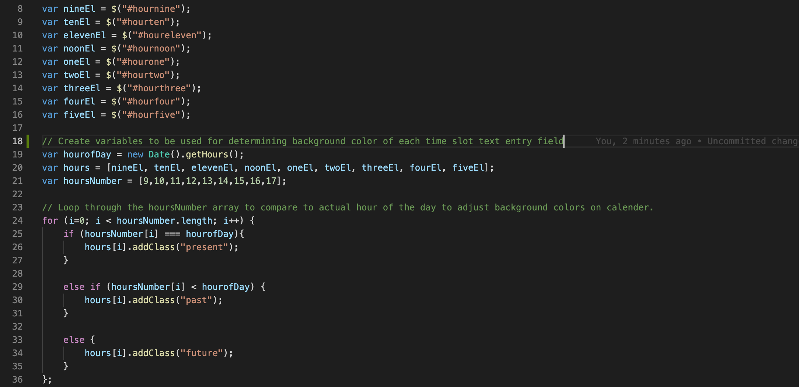
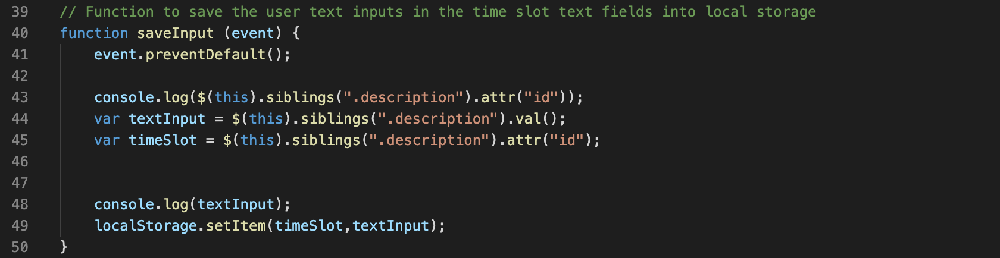
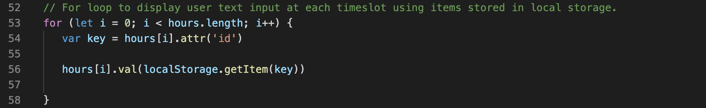

# Work-Scheduler
Calendar application for saving events by the hour for each day. This app runs in the browser and features dynamically updated HTML and CSS powered by jQuery.

## User Story

```md
AS AN employee with a busy schedule
I WANT to add important events to a daily planner
SO THAT I can manage my time effectively
```

## Acceptance Criteria

```md
GIVEN I am using a daily planner to create a schedule
WHEN I open the planner
THEN the current day is displayed at the top of the calendar
WHEN I scroll down
THEN I am presented with timeblocks for standard business hours
WHEN I view the timeblocks for that day
THEN each timeblock is color coded to indicate whether it is in the past, present, or future
WHEN I click into a timeblock
THEN I can enter an event
WHEN I click the save button for that timeblock
THEN the text for that event is saved in local storage
WHEN I refresh the page
THEN the saved events persist
```

The following animation demonstrates the application functionality:


## Project Development Process

### HTML

To start the project, most of the HTML was given. However, we needed to add the individual time blocks for each hour of the day:



This was done by utilizing the css style sheet already provided and cerating div elements for each time block. Within the parent div, there is a div for the displayed hour, a text area for where the user will enter their text, and lastly, a button for the user to click to save the text they entered:



This was repeated 9 times so that there was a time block for each hour from 9AM to 5PM. All of these time blocks are contained in a parent div with a class of container, which utilizes bootstrap to create the layout. Additionally, each element in the time blocks had bootstrap column sizing properties added in order to properly size each element. 

### Script

The bulk of the work was performed in the script file itself. To start, moment js was utilized in order to display the current date on the header of the page:



From here, we wanted to also adjust the time blocks text area background color based on the actual time of the day it currently is. To do this, we first used the specific ID's for each of the time blocks and assigned them to variables using jQuery. Then, we created a variable that holds the current time of day by using new Date().getHours() (which can be seen in the photo that follows on line 19). We then put each of the variables assigned to the time blocks via their respective ID's into an array in ascending order. And then finally, we created a variable to hold numerical values corresponding to the actual time block's corresponding time/hour. These arrays are necessary in order to utilize a for loop to adjust the time blocks background colors. See below for a visualization of what this looks like:



The next step was to handle saving the text inputs when the user clicked the save buttons. To do so, we first created a variable to assign to the save buttons using the class of saveBtn which they all shared. We used jQuery to create a on-click event which calls the saveInput function:


Within this function, we utilize "this" to ensure that whichever specific save button is clicked, the corresponding text input is saved. We save both the text input for that save button time block, and then also assign it to a key relating it to the time block at hand. Once this is done, we then set this text into local storage:



So now we have the inputs saved to local storage, but in order to prevent these inputs from clearing from the page when the page is refreshed, we need to handle displaying them by getting them from local storage. To do this, we created a for loop to loop through the array mentioned earlier containing the numerical hours of the day. We create a variable "key" to assign to the id of the hours array using hours[i].attr('id'). This is the key that is then used in the localstorage.getItem in order to get the specific text inputs. Then, the value of these text inputs (which is the text itself) is displayed onto the page in its respective time block. See blow for a visualization of this:




## Credits

Moment JS - [Moment Display](https://momentjs.com/docs/#/displaying/)

Bootstrap - [Containers](https://getbootstrap.com/docs/5.0/layout/containers/)

Bootstrap - [Forms](https://getbootstrap.com/docs/5.0/forms/overview/)

W3Schools - [Storage getItem Method](https://www.w3schools.com/jsref/met_storage_getitem.asp)

MDN Web Docs - [Window.localStorage](https://developer.mozilla.org/en-US/docs/Web/API/Window/localStorage)

MDN Web Docs - [Storage.setItem](https://developer.mozilla.org/en-US/docs/Web/API/Storage/setItem)

## Links

GitHub Repository - [Work-Day Scheduler Repository](https://github.com/ktrudickm/Work-Scheduler "Work Day Scheduler Repository")

Deployed Project - [Deployed Application](https://ktrudickm.github.io/Work-Scheduler/ "Deployed Application")